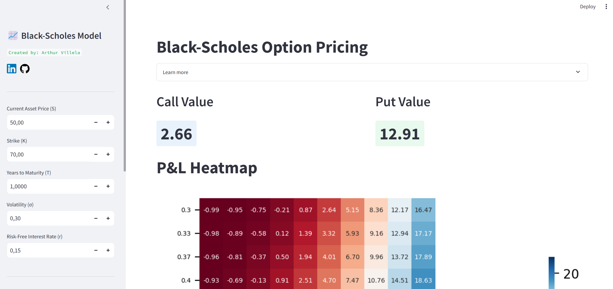
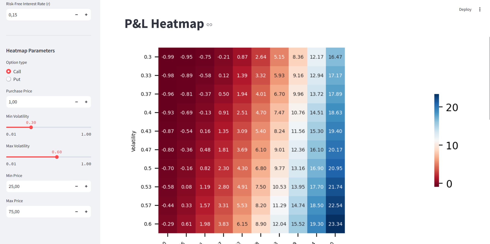
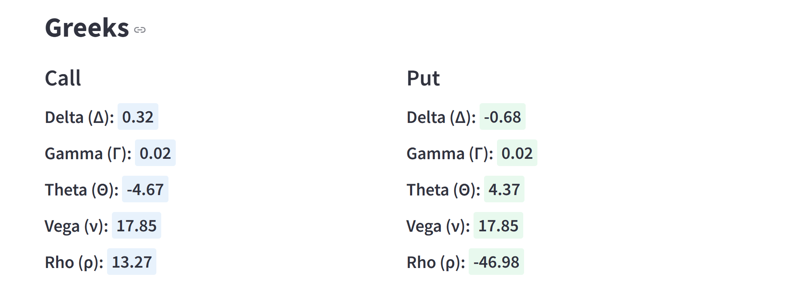
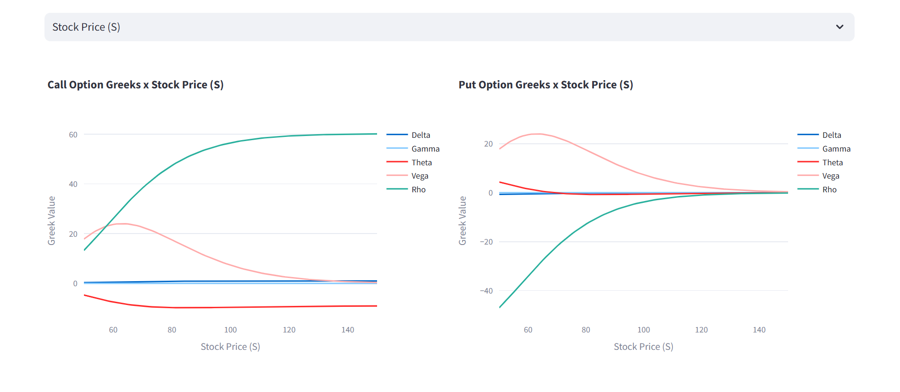

# Black-Scholes Option Pricing App
The purpose of this web application is to price call and put options through the Black-Scholes model. The P&L heatmap and greeks are also displayed so users can see how their positions are affected by the stock price, volatility, time and interest rates.

[Link](https://pricingoptions.streamlit.app/)

## Technologies Used
- **Python**: Implement the logic for the pricing model, heatmap and greeks.
- **Streamlit**: User interface

## Demo





## Relevant Code

```python

# Calculating d1
def d1(S, K, r, T, sigma):
    return (np.log(S/K)+T*(r+(sigma**2)/2))/(sigma*np.sqrt(T))

# Calculating d2
def d2(S, K, r, T, sigma):
    return d1(S, K, r, T, sigma) - sigma*np.sqrt(T)

# Call value calculation through Black-Scholes formula
def call_value(S, K, r, T, sigma):
    d1_val = d1(S, K, r, T, sigma)
    d2_val = d2(S, K, r, T, sigma)
    BS_call = S*norm.cdf(d1_val)-K*np.exp(-r*T)*norm.cdf(d2_val)
    return BS_call

# Put value calculation through Black-Scholes formula
def put_value(S, K, r, T, sigma):
    d1_val = d1(S, K, r, T, sigma)
    d2_val = d2(S, K, r, T, sigma)
    BS_put = K*np.exp(-r*T)*norm.cdf(-d2_val)-S*norm.cdf(-d1_val)
    return BS_put

# Greeks calculation
def delta(option_type, S, K, r, T, sigma):
    if option_type == "Call":
        return norm.cdf(d1(S, K, r, T, sigma))
    elif option_type == "Put":
        return norm.cdf(d1(S, K, r, T, sigma))-1

def gamma(S, K, r, T, sigma):
    return norm.pdf(d1(S, K, r, T, sigma))/(S*sigma*np.sqrt(T))

def theta(option_type, S, K, r, T, sigma):
    if option_type == "Call":
        return -S*norm.pdf(d1(S, K, r, T, sigma))*sigma/2*np.sqrt(T)-r*K*np.exp(-r*T)*norm.cdf(d2(S, K, r, T, sigma))
    elif option_type == "Put":
        return -S*norm.pdf(d1(S, K, r, T, sigma))*sigma/2*np.sqrt(T)+r*K*np.exp(-r*T)*norm.cdf(-d2(S, K, r, T, sigma))

def vega(S, K, r, T, sigma):
    return S*np.sqrt(T)*norm.pdf(d1(S, K, r, T, sigma))

def rho(option_type, S, K, r, T, sigma):
    if option_type == "Call":
        return K*T*np.exp(-r*T)*norm.cdf(d2(S, K, r, T, sigma))
    elif option_type == "Put":
        return -K*T*np.exp(-r*T)*norm.cdf(-d2(S, K, r, T, sigma))

```

## Stretch Goals